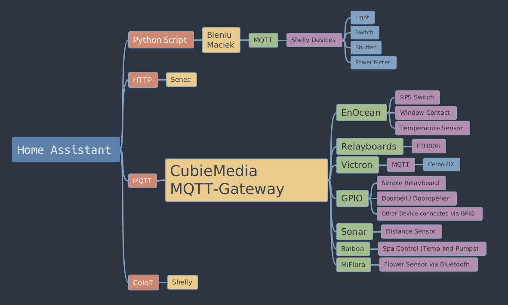

# mqtt-client

Gateway connecting different Protocols and Devices via MQTT

This works perfectly together with <b>Home Assistant</b> and is an important part of
the [CubieMedia - System](https://www.cubiemedia.de)

***

It supports following modules:

* Relayboards
    * [ETH 008](https://www.robot-electronics.co.uk/files/eth008.pdf)
    * one Gateway per Installation will control all Relayboards
* Enocean (with the Enocean Pi Hat)
    * [EnOcean Hat for Raspberry Pi](https://www.rasppishop.de/ENOCEAN-PI-868-Das-868MHz-Transceiver-Modul-fuer-Raspberry-Pi)
    * [Switch Eltako FT-55](https://www.amazon.de/Eltako-FT55-RW-Funktaster/dp/B004OXQ93G)
    * Enocean supports multiple Gateways per Installation for range extension
* GPIO (normal GPIO Pins on Pi)
    * [Simple Relayboards with Optokoppler](https://www.amazon.de/4-Kanal-Relais-Modul-Relay-Module-Optokoppler-Status-LEDs-Raspberry/dp/B07BGTWKMN)
    * Doorbell, door opener inclusion
    * Anything else you can attach to the GPIO's
* Sonar (Distance sensor with sound)
    * connect [Sonar](https://duckduckgo.com/?q=Modul+JSN-SR04T&iax=images&ia=images) sensor to serial uart over GPIO's
* Victron Energy MQTT Gateway
    * [Cerbo GX](https://www.victronenergy.com/communication-centres/cerbo-gx)
    * currently only one system per installation is supported

***

# Concept



***

# Installation

> 📝 **<font color="red">IMPORTANT</font>**
>
> The Services Enocean, GPIO and Sonar can NOT be used parallel on one device (because the GPIO Pins are needed for each
> service) All other services use other communication paths and can run on a single device.
>
> If the services can not reach needed Hardware a log message will show this. This messages will also happen in
> development
> environment (e.g. PyCharm) on your PC / Laptop

## Ubuntu Core

This Repository is made for the [Snap Store](https://snapcraft.io/) from Canonical. Since i am only using Ubuntu Core in
Development (not in Production) it is not tested very well and can have issues.

Please report them or send me a message.

> 1. Install Ubuntu Core on your device
> 2. Install the Snap on your device
>> snap install cubiemedia-mqtt-client [--devmode, --channel=latest/edge]
> 3. Connect plugs if needed
>> 1. snap connect cubiemedia-mqtt-client:serial-port pi:bt-serial
>> 2. snap connect cubiemedia-mqtt-client:gpio-memory-control pi:gpio-memory-control
>> 3. snap connect cubiemedia-mqtt-client:system-observe (TODO seems to be not needed anymore, remove plug?)
> 4. Enable Services or start the software manually
>> 1. sudo systemctl enable snap.cubiemedia-mqtt-client.[core,webtool,enocean,gpio,sonar,relay,victron] --now
>> 2. cubiemedia-mqtt-client [core,enocean,gpio,sonar,relay,victron] [debug|verbose]

## PyCharm

> 1. Clone the Repository
>> Git -> Clone... (with https://github.com/CubieMedia/mqtt-client as URL)
> 2. Setup python venv and install dependencies (requirements.txt). PyCharm will help you with this.
> 3. Create run configurations
>> 1. Right click on src/mqtt_client.py
>> 2. Select 'Modify Run Configuration...'
>> 3. Setup Service Run Configuration
>>> * **Name:** service name you want to start [Core,EnOcean,GPIO,Sonar,Relay,Victron]
>>> * **Parameters:** the service name, you can add debug|verbose here for more log messages
>>> * **Working Directory:** root folder of the project (default will be the src folder, remove '/src'!)
>> 4. Setup WebTool Configuration
>>> * **Name:** WebTool
>>> * **script:** ./venv/bin/flask
>>> * **Parameters:** run
>>> * **Working Directory:** root folder of the project (same as Service Configuration)
>>> * **Environment Variables:** FLASK_ENV=development;FLASK_RUN_PORT=8888;FLASK_RUN_HOST=0.0.0.0;FLASK_APP=./src/webtool/app.py
> 4. Change default config file ('./snap/hooks/install')
>> The core configuration contains connection data to your MQTT-Server and you need to change the
> > parameters [host,username,password]
> 5. Start the service and check log messages
>> journalctl -u cubiemedia-[enocean,gpio,sonar,relay,victron] -f

## Other Linux (e.g. Raspberry Pi)

> 1. Get your System in a stable state, install git and clone this repository
>> sudo apt update; sudo apt -y upgrade; sudo apt -y install git; git clone https://github.com/CubieMedia/mqtt-client
>
> 2. Install needed dependencies, create system services and start webtool with core
>> sudo mqtt-client/usr/bin/cubiemedia-install-dependencies
> 3. a. Run a simple test with a service (add parameter debug for more output)
>> 1. cd mqtt-client
>> 2. ./src/mqtt_client.py [enocean,gpio,sonar,relay,victron] [debug|verbose]
> 3. b. Enable the services you want (core and webtool are enabled by default)
>> sudo systemctl enable cubiemedia-[enocean,gpio,sonar,relay,victron] --now
> 4. Check everything is running in your Browser (WebTool) or in logs
>> 1. http://[DEVICE_IP]:8888
>> 2. journalctl -u cubiemedia-[core,webtool,enocean,gpio,sonar,relay,victron] -f
>> 3. send a raw 'announce' payload via MQTT to topic 'cubiemedia/command'

# Connection to Home Assistant

This MQTT-Client will not work without a central controlling unit. The client will announce devices on
'/cubiemedia/announce' and the controlling unit needs to create a connection between state of devices and the MQTT
Topics. With Home Assistant this is done via python scripts (
e.g. [HA-Shellies-Discovery](https://github.com/bieniu/ha-shellies-discovery))
The controlling unit will then read the announced devices and create Entities and Devices in Home Assistant and sends a
response as feedback to this MQTT-Client. This feedback is needed to check what Devices have been accepted by Home
Assistant and which not.
> 1. Get the script from this repository
>> ./HA/cubiemedia_discovery.py
> 2. Put it in your configuration folder under 'python_scripts'
>> copy it via Samba Addon or any possible way you prefer
> 3. Activate the python plugin in Home Assistant
>> 1. open your configuration.yaml
>> 2. add 'python_script:' to configuration
> 4. Create this two needed Automations
>```
>alias: CubieMedia Announce
>trigger:```
>  - event: start
>    platform: homeassistant
>action:
>  - delay:
>      hours: 0
>      minutes: 0
>      seconds: 1
>      milliseconds: 0
>  - data:
>      payload: announce
>      topic: cubiemedia/command
>    service: mqtt.publish
>initial_state: true
>mode: single
>```
>
>```
>alias: CubieMedia Discovery
>trigger:
>  - platform: mqtt
>    topic: cubiemedia/announce
>action:
>  - data_template:
>      payload: "{{ trigger.payload_json }}"
>    service: python_script.cubiemedia_discovery
>mode: queued
>max: 999
>initial_state: true
>```

***

Help is appreciated!
Contact me on Discord @Cubiemedia or via GitHub
